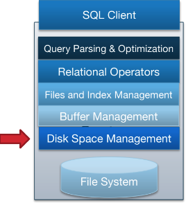
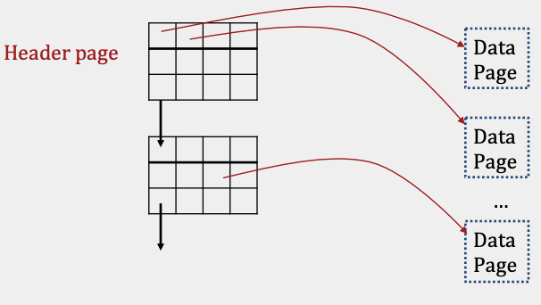

## Note1  Basic Queries
### NULL的处理
* NULL的任何计算都是NULL，包括x = NULL
* WHERE NULL 意味着 WHERE FALSE，不会包含任何结果
### 聚合
* 除COUNT（\*）之外，每个聚合函数都忽略NULL值，因此COUNT(<column>) 返回指定列的非NULL值数量，而COUNT(\*)返回整个表中的行数
### HAVING
* WHERE occurs before grouping. It filters out uninteresting rows.
  WHERE 发生在分组之前。它过滤掉不感兴趣的行。
* HAVING occurs after grouping. It filters out uninteresting groups.
  HAVING 发生在分组之后。它过滤掉不感兴趣的群体。

## Note2  Joins & Subqueries
* Subquery Factoring
* WITH 提取一个子查询
  ``` sql
  -- 用名称简化
  WITH courseEnrollment AS (
    SELECT c.num AS num1, c.name, e.num AS num2, e.students
    FROM courses AS c INNER JOIN enrollment AS e
    ON c.num = e.num;
  )
  -- 将简化的courseEnrollment当成自己的表
  SELECT num1, name, students
  FROM courseEnrollment
  WHERE students > 700;
  ```

## Note3 Disks and Files
### Memory and Disk
* 磁盘的读写效率很低，传输的单位是页
* 访问磁盘（读写）页面/块 的时间：
  * seek time (moving arms to position disk head on track);  2-3 ms on average
    > 寻道时间（移动磁臂将磁盘头定位在磁道上）；  平均 2-3 毫秒

  * rotational delay (waiting for block to rotate under head); 0-4 ms (15000 RPM)
    > 旋转延迟（等待方块在头下旋转）； 0-4 毫秒（15000 转/分钟）

  * transfer time (actually moving data to/from disk surface); 0.25 ms per 64KB page
    > 传输时间（实际将数据移入/移出磁盘表面）；每 64KB 页 0.25 毫秒

* 磁盘空间管理
  * 磁盘空间管理是 DBMS 的最低层。它负责管理磁盘空间。其主要用途包括将页面映射到磁盘上的位置、将页面从磁盘加载到内存以及将页面保存回磁盘并确保写入。
    
  
### Files, Pages, Records
* 关系型数据库系统的基本单位是**record (row)**，record被组织成**relations (tables)** ，可以在内存中被增删改查。
* 磁盘数据的基本单位是page，每张表被被组织成多个page形成了一个file，file被组织成database。
*  Based on the relation’s schema and access pattern, the database will determine: (1) type of file used, (2) how pages are organized in the file, (3) how records are organized on each page, (4) and how each record is formatted.
  
    > 基于关系模式的访问模式，数据库将决定：(1) 使用的文件类型，(2) 文件中的页面如何组织，(3) 每个页面上的记录如何组织，(4) 以及每个页面如何组织记录已格式化。
### Choosing File Types
* There are two main types of files: Heap Files and Sorted Files.
* 对于每张表，数据库将通过I/O成本来选择类型，1I/O相当于读或者写一页
#### Heap File
* 一种文件类型，没有特定的页面顺序
##### 链表实现
* 每个数据页包含了records(很多行)， free space tracker，上下页指针
  * 数据页分为完整页和空闲页，full pages and free page。
* 有一个 header page


##### Page Directory Implementation 页目录实现
* 和链表实现的不同在于：using a linked list for header pages，在标头页使用链表 
* 标头页包含指针和可用空间
* 数据页仅存数据
> 相对链表的优点是插入快
> 搜索相对都比较慢，需要完整扫描

#### Sorted Files
* 页是按照key有序排序的
* 没说实现，但是查找用二分，复杂度：logN I/Os
* 插入可能会移动后面的页， logN + N I/O
### A Note on Counting Header Pages
* 关于需不需要计算Header的IO成本
### Record Types
> 行的格式
  * 固定长度记录（FLR）和可变长度记录（VLR）
  * VLR的时候，Header要记录Record的尾部
### Page Formats
> 页的格式
* Pages with Fixed Length Records
  * 用page headers去存储当前的records数量
  * 因为知道了record的数量和长度，所以插入很容易
* Pages with Variable Length Records
  * 有一个page footer去维护 a slot directory 用来跟踪 slot count, a free space pointer, and entries
### Field Types
> cs186的约定

| Type     | Data Type  | Size (B) |
|----------|------------|----------|
| Fixed    | Integer    | 4        |
| Fixed    | Float      | 4        |
| Fixed    | Boolean    | 1        |
| Fixed    | Byte       | 1        |
| Fixed    | Char(N)    | N        |
| Variable | Varchar(N) | <= N     |
| Variable | Text       | >= 0     |

## 总结和问题
* 每个文件包含了多页，每页里面有多行
* 是不是一个文件对应一张表
* 对于索引来说，索引是file之上的东西，还是说index file也是一种file，和sorted file是同级的概念
* 什么是页的packed和unpacked
