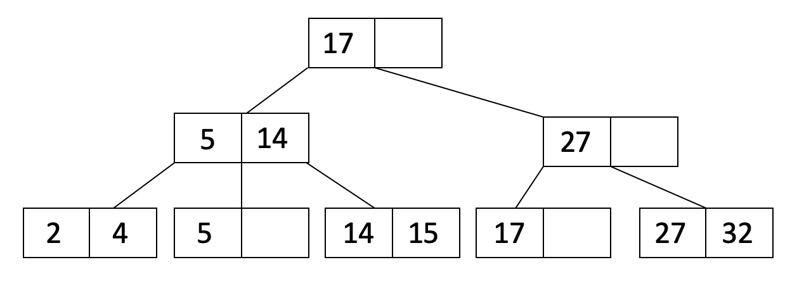

## Note4 B+Trees

### 特性
* order
> 每个除root以外的节点，order ≤ x ≤ 2order 的entities，并且entities要排序
* 每个entry （元素）之间都有一个指向子节点的引用，最多有2dorder+1个entry，也称为fanout
* 对于某个entry，其左侧子节点的keys <= entry.key <= 右侧子节点的keys
* 所有叶子节点都会处于相同的深度
### Insertion
* 步骤：
  * 找到需要插入的叶子节点，插入叶子节点
  * 如果插入后，叶子节点的keys数量超过order，则需要分裂
    * 分裂就是节点的元素数为2*order+1，需要分裂成order个和order+1个
  * 分裂之后，父节点的指针不对了，需要将分裂之后的右边那个节点的第一个元素，添加到父节点
    * 如果子节点是叶子节点，则复制
    * 如果子节点是内部节点，则移动（右边的第一个元素）
  * 插入之后，父节点的keys数量超过order，则需要分裂
  * 递归
### Deletion
* 只需要找到叶子节点然后删除，不需要删除内部节点的key
* 按照规范其实删除后需要重新平衡树的，但是因为插入比较频繁，做了简化
### Storing Records
> 如何存储records
1. 叶子节点存储数据，而非指针
   *  有个限制就是不同的索引无法使用相同的文件
2. 用引用
3. 用引用的集合
### Clustering
* 方案1是聚簇的，方案2，3是非聚簇的
* 非聚簇索引，访问一个record就需要一次IO
* 聚簇索引的数据页一般是有序的，所以一页是一次IO
### Counting IO’s
* 在树上没查找一次就是一个IO
* 读非聚簇的record，需要IO
* 写回数据页，一个IO
* 删除节点的key，一个IO
### Bulk Loading
> 如何批量插入
* 先把keys进行排序
* 确定一个填充因子f
* 从叶子节点开始填充
* 当填充到了2\*order\*f个，填下一个页，并且生成一个父节点
* 父节点满了就按照插入的规则分裂
### 总结和问题
* 为什么不能对非聚簇索引的数据文件排序呢
> 可能是数据页只有一份，非聚簇是辅助索引，数据页不能完全和索引的顺序一致