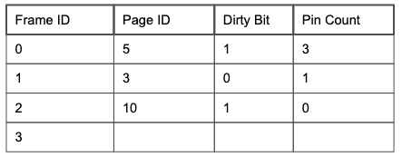

## Buffer Management
> * 介于磁盘空间管理和基于页的文件索引管理之间的接口
> * 负责管理内存中的页，并处理来自file and index manager的请求，同时会处理逐出页面和将新页面读入内存
### Buffer Pool
* 通过一个metadata table来记录内存的帧与磁盘的页的映射关系和状态

* Frame ID that is uniquely associated with a memory address
    > 与内存地址唯一关联的帧 ID

* Page ID for determining which page a frame currently contains
    > 用于确定框架当前包含哪个页面的页面 ID

* Dirty Bit for verifying whether or not a page has been modified
    > 脏位用于验证页面是否已被修改，内存中更新后为1，写回磁盘后为0

* Pin Count for tracking the number of requestors currently using a page
    > Pin 计数，用于跟踪当前使用页面的请求者数量
### Handling Page Requests
1. 请求页面已存在：增加该页面的引脚计数（pin count）会并返回该页面的内存地址。
2. 请求页不存在并且内存仍有空间：找到下一个空帧并将该页插入该帧。该页的引脚计数设置为 1，并返回该页的内存地址
3. 请求页不存在并且内存没有空帧：需要用 replacement policy来逐出页面，如果驱逐的时候页面是脏的，则将其写回磁盘
### LRU Replacement and Clock Policy
* LRU(Least Recently Used)：最近最少被使用，即最近没有被访问的页面
* 在元数据表中加一列Last Used
* 或者使用Clock Policy策略
  > 元数据表增加引用位和一个时钟指针，时钟指针指向某一帧
  1. 初始化：
  时钟指针指向第一个未固定的帧，所有页面的参考位初始为1。
  2. 访问页面：
  每当访问一个页面（无论是读还是写），将该页面的参考位设为1。
  3. 页面替换：
  当需要将新页面读入已满的缓冲池时，时钟算法会进行以下步骤：
   * 检查参考位：从时钟指针当前所指的帧开始，检查其参考位。
   * 参考位为1：如果参考位为1，表示该页面最近被访问过，将参考位设为0，并将时钟指针移动到下一个帧。
   * 参考位为0：如果参考位为0，表示该页面最近未被访问，选择该页面进行替换。
     * 如果该页面有修改（脏位为1），将页面写回磁盘，并将脏位设为0。
     * 将新页面读入该帧，将其参考位设为1，并将时钟指针移动到下一个帧。
  * 分析：
    * 参考位1代表被访问过，0代表未被访问过
    * 替换发生时，被扫描过的会被置成0
    * 频繁访问的页，会在扫描之后也被置成1
    * 无人问津的，扫描之后一直就是0
    * 比较LRU的不严谨的情况：
      * 一共5s时间，2s内A被访问了2次，B被访问了2次，3s的时候A被访问了一次，4s的时候扫描替换了C，5S的时候先扫描了A，A就被替换了
#### Sequential Scanning Performance - LRU
> 顺序扫描的性能低下
* 当频繁访问的页面数 > 缓冲池大小，LRU性能会降，称为sequential flooding
* 比如缓冲池的帧数是3，但是需要按顺序访问ABCDABCD...
### MRU Replacement  MRU
* MRU(Most Recently Used)：最近被使用，即最近被访问的页面，和LRU相反吗
* 数据访问模式具有较强的周期性，并且最近访问的数据不太可能再次被访问。
* 特定应用程序缓存数据的模式更适合 MRU 策略，例如某些类型的图形处理或多媒体缓存。

* 比较适合上述的顺序扫描

## Relational Algebra
* 逻辑运算符：
  * Projection: π
    * 投影操作，用于选择表中指定的列
  * Selection: σ
    * 选择操作，用于从表中选择满足条件的行。
  * Union: ∪
    * 并集操作，用于将两个关系中的所有行合并（去重）。
  * Set Difference: −
    * 差集操作，用于从一个关系中移除另一个关系中存在的行。
  * Cross Product: ×
    * 笛卡尔积操作，将两个关系的每一行组合。
  * Joins: ⋈
    * 连接操作，通常用于根据条件连接两个表。
  * Rename: ρ
    * 重命名操作，用于给表或列赋新名称。
  * Group By / Aggregation: γ
    * 分组聚合操作，用于按指定列分组并执行聚合函数。


## Sorting
## Hashing
### Motivation 动机
> 有时候不关心顺序，只想把相同的放在一起（group by），grouping like values together is called hashing
> 由于无法全部使用内存，需要使用out-of-core hashing algorithm，借助外部存储来计算和存储
### General Strategy 总体策略
> 类似MapReduce?
### The Algorithm 具体算法
> 假设内存中有B个可用帧
* 取一个当作input buffer,其他的（B-1）当作 output buffers
* 当input buffer来了，就用特定的哈希函数散列到各个分区，如果输出缓冲区已满，则该页面将刷新到磁盘
* 来自同一缓冲区的任何刷新页面将在磁盘上彼此相邻
* 对于太大的分区，需要多次使用不同的hash函数，减小分区大小
## Sorting
### Two Way External Merge Sort
* 对每个单独页面上的记录进行排序
## Iterators and Joins
### Simple Nested Loop Join
> 最简单的策略，两层for循环
* 示例：R join S
```js
for each record r in R:
  for each record s in S:
    if mach(r,s):
      yield(r,s)
```
* I/O 成本：PageSize(R)+RecordSize(R)*RecordSize(S)
> R的页数+R的记录数*S的记录数（一页有多条记录，按页读取，然后按行查找）
> 
:::tip
可以置换R和S的顺序稍微优化一下IO
:::
### Page Nested Loop Join
> 基于页面的嵌套循环
* 示例：R join S
``` python
for each page R_P in R:
    for each page S_j in S:
        for each record r in R_P:
            for each record s in S_j:
                if θ(r, s):
                    yield <r, s>
```
* I/O 成本：PageSize(R)+PageSize(R)*PageSize(S)
### Block Nested Loop Join
> 分块嵌套循环
* 示例：R join S
> 假设缓冲区有B页，1个是输出缓冲区，1个用于S，B-2个用于R
:::tip
如果有B-2个页，那么一次读B-2个页，一次读一块，一块有B-2个页，R的大小是PageSize(R)个页，一共有PageSize(R)/(B-2)块
:::
``` python
# 前提:一次读取PageSize(R)
# PageSize(R)/(B-2)个block
for each block B_R in R:
  # PageSize(S)
    for each page P_S in S:
        for each record r in B_R:
            for each record s in P_S:
                if θ(r, s):
                    yield <r, s>

```
* I/O 成本：PageSize(R)+(PageSize(R)/(B-2))*PageSize(S)
### Index Nested Loop Join
> 在S表需要连接的字段有索引的情况下
* 示例：R join S
``` python
for each record r in R:
    for each page s in S where θ(r, s):
        yield <r, s>

```
* I/O 成本：PageSize(R)+RecordSize(R)*(每次索引查询的消耗)
### Hash Join
#### Naive Hash Join
> 遍历左表，生成一个hash表，然后遍历右表，在hash表中查找
#### Grace Hash Join
:::tip
* 用page作为计量单位，假设缓冲区共有B个页，可用的是B-2个页
* 分区的时候，将表分成B-1个分区，这个操作是在磁盘上做的
* 缺点很明显，例如相同的key的记录过大，hash不能分散到各个分区，那就得抛异常了
:::

* 把左右表都分区，然后分别去一个进行构建和查找
* 如果左右表的页大小都大于B-2，就递归run，继续分成更小的分区
* run的方法就是构建map和匹配连接成一个reccord


### Sort-Merge Join
### Query Optimization
* 基本步骤
  * 流式输出：operator -> iterator  -> another operator


## 总结和问题
* 帧和页
  > page = block of consecutive virtual memory
  > frame = block of consecutive physical memory